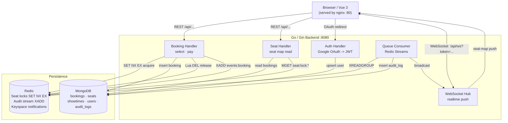

# Cinema Ticket Booking System

A concurrent seat-booking service built for correctness under contention.
Multiple users racing for the same seat will never produce a double booking.

---

## 1. System Architecture



**Happy-path request flow:**
`Browser -> BookingH -> Redis lock (NX) -> Mongo insert -> Redis stream -> release lock -> 200`

**Realtime flow:**
`Queue Consumer reads stream -> writes AuditLog -> broadcasts via WS Hub -> all connected browsers update seat map`

---

## 2. Tech Stack

| Layer | Choice | Why |
|-------|--------|-----|
| Backend | Go 1.26 + Gin | Goroutines map cleanly onto per-request lock/wait semantics; Gin adds routing without magic |
| Database | MongoDB 7 | Flexible schema; compound unique index is the last-resort double-booking guard |
| Cache / Lock | Redis 7 | Atomic `SET NX EX` for distributed locks; Streams for durable async queue — one infra component, two roles |
| Realtime | WebSocket (Gin upgrade) | Push seat-map deltas to all connected clients without polling |
| Queue | Redis Streams | Durable, consumer groups, at-least-once delivery — see §5 |
| Auth | Google OAuth 2.0 -> backend JWT | Delegates credential management to Google; backend mints its own JWT so we fully control the role claim |
| Frontend | Vue 3 + Vite (nginx) | SPA with Pinia auth store, realtime seat map, select/pay flow, admin dashboard |
| Deploy | Docker + docker-compose | Single `docker compose up --build`; no external runtime dependencies |

---

## 3. Booking Flow

### Step-by-step (happy path)

```
1.  GET  /api/showtimes
        -> list available showtimes

2.  GET  /api/showtimes/:id/seats
        -> seat grid: each seat is AVAILABLE | LOCKED | BOOKED
          (merged at read time from Mongo bookings + Redis lock keys)

3.  POST /api/showtimes/:id/seats/:seatId/select
        -> SET seat:lock:{showtimeId}:{seatId} <ownerToken> NX EX <LOCK_TTL_SECONDS>
        -> 409 if another client already holds the lock
        -> returns { ownerToken, expiresAt }
        -> SEAT_LOCKED WS event pushed to all connected clients

4.  [countdown] client holds the seat for up to LOCK_TTL_SECONDS (default 300 s)

5.  POST /api/showtimes/:id/seats/:seatId/pay   { ownerToken }
        -> Lua script: GET key -> compare -> DEL (atomic owner check)
        -> 410 if lock expired; 409 if already booked
        -> db.bookings.insertOne({ showtimeId, seatId, userId })
          unique index fires -> 409 on any duplicate (last safety net)
        -> releases lock
        -> SEAT_BOOKED WS event pushed to all clients
        -> BOOKING_SUCCESS published to Redis Stream for async audit
```

### No-pay path (timeout)

```
        lock TTL fires (Redis auto-deletes key)
        -> keyspace notification received by backend
        -> SEAT_RELEASED WS event pushed to all clients
        -> seat returns to AVAILABLE on all connected browsers
```

### Cancel path (explicit release)

```
DELETE /api/showtimes/:id/seats/:seatId/select   { ownerToken }
        -> Lua script: GET key -> compare -> DEL (same atomic owner check as pay)
        -> released=false (no-op) if ownerToken is wrong or the lock already
           expired/was reclaimed by someone else — no audit row, no broadcast
        -> released=true  -> writes SEAT_RELEASED AuditLog (meta.source="user-cancel")
                           -> SEAT_RELEASED WS event pushed to all clients
                           -> seat flips to AVAILABLE immediately, not after the TTL
```

The frontend's Cancel button calls this endpoint best-effort before clearing its own
hold panel — see the DEL-vs-expired-notification note in §4 for why the handler must
broadcast explicitly instead of relying on the same keyspace-notification path as the
timeout case above.

### Auth flow

```
Browser                  Backend                 Google
  |-- GET /auth/google/login --|                      |
  |                            |-- 302 to consent --> |
  |<-- 302 (via Google) -------|                      |
  |                            |                      |
  | GET /auth/google/callback?code=...               |
  |                            |-- exchange code ---> |
  |                            |<-- access token ---- |
  |                            |-- GET /userinfo ----> |
  |                            |<-- {email, name} ---- |
  |                            |                      |
  |                            | upsert user (Mongo)
  |                            | assign role (ADMIN_EMAILS allowlist)
  |                            | mint JWT HS256
  |<-- 302 /auth/callback?token=<jwt> --------------|
```

CSRF protection: a random 16-byte hex state is set as an `httpOnly` cookie before the redirect; compared on callback; immediately cleared.

JWT payload:
```json
{ "sub": "<ObjectID>", "email": "user@example.com", "role": "USER", "iat": …, "exp": … }
```

All `/api/*` endpoints require `Authorization: Bearer <token>`.  
WebSocket upgrade passes the token as `?token=<jwt>` (browser WS API cannot send custom headers).

---

## 4. Concurrency Correctness

Three independent layers prevent double booking:

| Layer | Mechanism | What it prevents |
|-------|-----------|-----------------|
| 1 | Redis `SET NX EX` | Only one client acquires the lock; all others get 409 immediately |
| 2 | Lua owner-check on release | A client can only release a lock it still owns; prevents a late DEL from deleting a lock re-acquired by another client after TTL expiry |
| 3 | MongoDB unique index `{ showtimeId: 1, seatId: 1 }` | Even if both layers above have a latent bug, the second `insertOne` fails with duplicate-key -> 409; no data corruption |

**Proven by the concurrency test (50 goroutines, single seat):**

```
=== RUN   TestConcurrentSelectPay
    goroutines  = 50
    successes   = 1   <- must be 1
    conflicts   = 49  <- must be 49
    seat status = BOOKED
--- PASS: TestConcurrentSelectPay (0.35s)

=== RUN   TestConcurrentSelectOnly
    goroutines  = 50
    acquired    = 1   <- must be 1
    rejected    = 49  <- must be 49
    seat status = LOCKED
--- PASS: TestConcurrentSelectOnly (0.22s)

ok  cinema-booking/backend/test  2.544s
```

### Redis Lock detail

```
SET seat:lock:{showtimeId}:{seatId}  {ownerToken-UUID}  NX  EX {LOCK_TTL_SECONDS}
```

- **`NX`** — sets only if key does not exist; exactly one concurrent caller wins.
- **`EX`** — auto-expires; a crashed client never leaves a seat permanently locked.
- **`ownerToken`** — UUID generated fresh per attempt; echoed back by client in `pay`.

**Release script (atomic Lua):**
```lua
if redis.call("GET", KEYS[1]) == ARGV[1] then
    return redis.call("DEL", KEYS[1])
else
    return 0
end
```

Without atomicity, a slow client whose TTL already fired could `DEL` a key now owned by a different client. The Lua script makes check-then-delete a single Redis operation.

**DEL vs. expired — why the explicit release endpoint broadcasts manually:** Redis only fires a keyspace `expired` event when a key's TTL naturally counts down to zero; an explicit `DEL` (what the Lua release script above does) is silent — no keyspace notification, ever. `WatchLockExpiry` (§3's timeout path) only listens for `expired` events, so it never observes a manual release. The `Release` handler (§3's cancel path) therefore writes the `SEAT_RELEASED` audit row and calls `hub.Broadcast` itself, synchronously, in the same request — it cannot piggyback on the expiry watcher the way the timeout path does.

**Why not Redlock:** Redlock is for multi-node deployments where partial writes and clock drift are real. This system runs a single Redis node — `SET NX EX` is both correct and sufficient here.

---

## 5. Message Queue (Redis Streams)

`POST .../pay` publishes a `BOOKING_SUCCESS` event to stream `events:booking` and returns 200 immediately. A background consumer goroutine reads the stream via `XREADGROUP` and:

1. Writes a `BOOKING_SUCCESS` `AuditLog` to MongoDB (`meta.source = "stream-consumer"` proves the async path ran).
2. Logs a mock notification: `NOTIFY: emailed <user> about booking <id>`.
3. `XACK` only after both succeed; on failure the message stays in the PEL (pending entries list) for retry.
4. A separate ticker goroutine runs `XAUTOCLAIM` every 15s, reclaiming any entry that has sat unacked for 30s+ (owner crashed, or errored and never came back) and reprocessing it through the same handler — no restart required. An entry reclaimed more than 5 times is written to `events:booking:dead` and ACKed off the main stream instead of being retried forever, so one permanently-failing message can't loop indefinitely.

**Recorded evidence (stream -> consumer -> audit log):**
```
# Stream entry
1781081403904-0
event {"action":"BOOKING_SUCCESS","bookingId":"6a29253b9539d4af7c263a56",
       "showtimeId":"000000000000000000000001","seatId":"6a27f28742ab1a2c542913ea",
       "userId":"6a29253b9539d4af7c263a53","userEmail":"stream-user@test.com"}

# Consumer log line
2026/06/10 08:50:03 NOTIFY: emailed stream-user@test.com about booking 6a29253b9539d4af7c263a56

# Audit document written by consumer
{ action: "BOOKING_SUCCESS", meta: { source: "stream-consumer" }, createdAt: "2026-06-10T08:50:03.905Z" }
```

**Why Streams over Pub/Sub:** Pub/Sub loses messages if no subscriber is connected at publish time. An audit log that silently drops records on restart is unacceptable. Streams persist entries until explicitly trimmed; unACKed messages stay in the PEL and are reclaimed by the `XAUTOCLAIM` loop described above.

**Why Streams over RabbitMQ:** Redis is already in the stack for locking. Adding RabbitMQ means a third infrastructure component, a separate Go AMQP client, and additional ops surface area for no correctness benefit at single-service scale.

---

## 6. How to Run

### Prerequisites

- Docker and Docker Compose (no other local dependencies required)

### Step 1 — copy the env file

```bash
cp .env.example .env
```

### Step 2 — choose an auth mode

#### Option A — DEV_AUTH (recommended for evaluators, no Google credentials needed)

Edit `.env`:
```ini
DEV_AUTH=true
JWT_SECRET=any-long-random-string
SEED_ON_START=true
# Leave GOOGLE_CLIENT_ID / GOOGLE_CLIENT_SECRET as placeholder values
```

With `DEV_AUTH=true` the backend exposes `POST /dev/token` which mints a JWT for any email/role you supply — no OAuth round-trip. The frontend dev-login form (email + role selector) is compiled in automatically.

#### Option B — Google OAuth (full production-like flow)

1. Open [Google Cloud Console -> APIs & Services -> Credentials](https://console.cloud.google.com/apis/credentials).
2. Create an **OAuth 2.0 Client ID** (Web application).
3. Add `http://localhost:8080/auth/google/callback` to **Authorised redirect URIs**.
4. Copy the **Client ID** and **Client secret** into `.env`:

```ini
GOOGLE_CLIENT_ID=<your-client-id>.apps.googleusercontent.com
GOOGLE_CLIENT_SECRET=<your-client-secret>
GOOGLE_REDIRECT_URL=http://localhost:8080/auth/google/callback
JWT_SECRET=any-long-random-string
SEED_ON_START=true
DEV_AUTH=false
```

### Step 3 — start everything

```bash
docker compose up --build
```

First run pulls base images and compiles the Go binary (~5 min on Docker Desktop).
Subsequent runs use the layer cache and start in seconds.

### Step 4 — open the app

| URL | What |
|-----|------|
| `http://localhost` | Vue 3 SPA (login -> showtimes -> seat map -> admin) |
| `http://localhost:8080/healthz` | `{"mongo":"ok","redis":"ok","status":"ok"}` |
| `http://localhost:8080/api/showtimes` | raw API (requires Bearer token) |

### Step 5 — make yourself an admin

In `.env`, set:
```ini
ADMIN_EMAILS=your-email@example.com
```

Then restart the backend so it re-reads the env:
```bash
docker compose up -d --force-recreate backend
```

Log in with that email (OAuth or dev-login with that exact address). The JWT will carry `"role":"ADMIN"` and the **Admin** nav link will appear.

### Running the concurrency test

The stack must be running with `DEV_AUTH=true` and `SEED_ON_START=true`.

```bash
# From the repo root
cd backend
go test ./test/ -v -count=1
```

Expected output:
```
=== RUN   TestConcurrentSelectPay
    concurrency_test.go:188:   goroutines  = 50
    concurrency_test.go:189:   successes   = 1  <- must be 1
    concurrency_test.go:190:   conflicts   = 49 <- must be 49
    concurrency_test.go:191:   seat status = BOOKED
--- PASS: TestConcurrentSelectPay (0.35s)
=== RUN   TestConcurrentSelectOnly
    concurrency_test.go:248:   goroutines  = 50
    concurrency_test.go:249:   acquired    = 1  <- must be 1
    concurrency_test.go:250:   rejected    = 49 <- must be 49
    concurrency_test.go:251:   seat status = LOCKED
--- PASS: TestConcurrentSelectOnly (0.22s)
PASS
ok  cinema-booking/backend/test  2.544s
```

The test points 50 goroutines at the same seat simultaneously. Exactly one wins; 49 receive a conflict. The seat is never double-booked.

### Minting tokens manually (DEV_AUTH=true)

```bash
# USER token
curl -s -X POST http://localhost:8080/dev/token \
  -H 'Content-Type: application/json' \
  -d '{"email":"alice@test.com","role":"USER"}' | jq -r .token

# ADMIN token
curl -s -X POST http://localhost:8080/dev/token \
  -H 'Content-Type: application/json' \
  -d '{"email":"admin@test.com","role":"ADMIN"}' | jq -r .token
```

`DEV_AUTH` is never enabled unless explicitly set to `true` — the endpoint is not registered otherwise.

---

## 7. Assumptions & Trade-offs

**Single Redis node** — accepted. A multi-node cluster would require Redlock or a different scheme. At single-node scale, `SET NX EX` is correct and simpler to reason about.

**Seat status is computed, not stored** — `BOOKED` is a durable Mongo document; `LOCKED` is an ephemeral Redis key; `AVAILABLE` means neither. No `status` field on the Seat document. This avoids a cache-invalidation problem: if status were cached in Mongo, a lock expiry would require a Mongo write to keep them consistent. Merge-at-read is always consistent at the cost of two reads per seat map fetch.

**Lock TTL as the only cancel mechanism** — if a user selects a seat and closes the tab, the lock auto-expires after `LOCK_TTL_SECONDS`. There is no explicit "release" endpoint. The TTL is the safety valve, and the frontend displays a visible countdown to set user expectations.

**Keyspace notifications are best-effort** — `notify-keyspace-events Ex` delivers `SEAT_RELEASED` WS pushes when TTL fires. Redis delivers at most once — a missed notification means a client's UI is stale until it polls again. This never causes an incorrect booking: the TTL still fires and the Redis key is deleted regardless; `GET .../seats` always recomputes from live Redis+Mongo and returns the correct status. Only the real-time UX is affected, not data integrity.

**Roles are minted at login, not dynamically updated** — `ADMIN_EMAILS` is checked at OAuth callback time; the role is baked into the JWT. Revoking admin access requires the token to expire or a redeploy with the email removed. Acceptable for an internal admin use case; not suitable for fine-grained RBAC.

**No real payment integration** — booking commits as soon as the Mongo insert succeeds. A real payment step would sit between lock acquisition and the Mongo insert, with the lock held across the payment round-trip or the session tied to an idempotency key. Explicitly out of scope per the assignment brief.

**Idempotent seed** — `SEED_ON_START=true` upserts 2 showtimes and 80 seats using `$setOnInsert`. Safe to run on a populated database; will not overwrite existing bookings.
