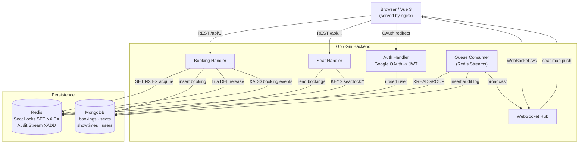

# Cinema Ticket Booking System

A concurrent seat-booking service built for correctness under contention.
Multiple users racing for the same seat will never produce a double booking.

---

## 1. System Architecture



**Request path for a booking (happy path):**
`Browser -> BookingH -> Redis lock (NX) -> Mongo insert -> Redis stream -> release lock -> 200`

**Realtime path:**
`Queue Consumer reads stream -> writes AuditLog -> broadcasts via WS Hub -> Browser updates seat map`

---

## 2. Tech Stack

| Layer | Choice | Why |
|-------|--------|-----|
| Backend | Go 1.26 + Gin | Low-overhead goroutines map cleanly onto per-request lock/wait semantics; Gin adds routing without magic |
| Database | MongoDB 7 | Flexible schema for seat/showtime documents; atomic `findAndModify` available as a fallback; driver v2 |
| Cache / Lock | Redis 7 | Atomic `SET NX EX` for distributed locks; Streams for durable async queue — one infra component does both |
| Realtime | WebSocket (Gin upgrade) | Push seat-map deltas to all connected clients without polling |
| Queue | Redis Streams | See Section 5 |
| Auth | Google OAuth 2.0 -> backend JWT | Delegates credential management to Google; backend mints its own JWT so we control the role claim |
| Frontend | Vue 3 (pre-built, served by nginx) | Out of scope for this assessment |
| Deploy | Docker + docker-compose | Single `docker compose up --build` brings the full stack; no external dependencies |

---

## 3. Booking Flow

### Auth flow (implemented)

```
Browser                  Backend                 Google
  |                         |                      |
  |-- GET /auth/google/login|                      |
  |                         |-- redirect --------->|
  |<------- 302 to consent--|                      |
  |                         |                      |
  |<-- GET /auth/google/callback?code=...&state=...|
  |                         |-- exchange code ----->|
  |                         |<-- access token ------|
  |                         |-- GET /userinfo ------>|
  |                         |<-- {email, name} ------|
  |                         |                      |
  |                         | upsert users (Mongo)
  |                         | resolve role (ADMIN_EMAILS)
  |                         | mint JWT (HS256)
  |<-- 200 {"token":"..."} -|
```

CSRF protection: a random 16-byte hex state is set as an `httpOnly` cookie before the redirect. On callback the query param is compared against the cookie and the cookie is immediately cleared.

JWT payload:
```json
{
  "sub":   "<mongo ObjectID hex>",
  "email": "user@example.com",
  "role":  "USER",
  "iat":   1234567890,
  "exp":   1234567890
}
```

Subsequent requests must carry `Authorization: Bearer <token>`.

### Seat map read (implemented)

`GET /api/showtimes/:showtimeId/seats` — requires valid JWT. Returns all seats annotated with their status, derived at read time by merging two sources:

| Status | Source |
|--------|--------|
| BOOKED | Booking document exists in MongoDB |
| LOCKED | Redis key `seat:lock:{showtimeId}:{seatId}` exists |
| AVAILABLE | Neither |

Redis unavailability degrades gracefully to AVAILABLE (lock state is ephemeral; the Mongo unique index remains the hard safety net).

### Booking write flow (implemented)

```
POST /api/showtimes/:showtimeId/seats/:seatId/select
  1. Reject if seat already BOOKED in Mongo (CountDocuments).
  2. SET NX EX  ->  acquire lock, receive ownerToken UUID.
  3. 409 if another holder already owns the lock.
  4. Return {ownerToken, expiresAt}.  Write SEAT_LOCKED audit.

POST /api/showtimes/:showtimeId/seats/:seatId/pay
  body: {"ownerToken": "<uuid>"}
  1. Lua GET+compare -> verify caller still owns lock (Owned / Expired / WrongOwner).
  2. 410 "hold expired, reselect" if not Owned.  Write BOOKING_TIMEOUT or LOCK_FAIL audit.
  3. InsertOne booking into Mongo.
  4. Unique index {showtimeId, seatId} fires on duplicate -> 409.
  5. Release lock (Lua DEL if owner matches — non-fatal if TTL already fired).
  6. Return 200.  Write BOOKING_SUCCESS audit.
```

**ownerToken design choice:** `select` returns the raw UUID lock token to the client, which must echo it back in `pay`. This is explicit and simple for a take-home assessment — the token proves the client holds the current lock. The alternative (storing the token server-side in a session or short-lived JWT) would add complexity without improving the correctness guarantee, which lives in the Lua ownership check and the Mongo unique index regardless.

---

## 4. Redis Lock Strategy

### Mechanism

```
SET seat:lock:{showtimeId}:{seatId}  {ownerToken}  NX  EX {LOCK_TTL_SECONDS}
```

- **`NX`** — only sets if the key does not exist. Two concurrent requests can race; exactly one wins.
- **`EX {ttl}`** — key auto-expires, so a crashed client never leaves a seat locked forever. TTL is configurable via `LOCK_TTL_SECONDS` (default 300 s; set to 30 s for the demo so timeout behaviour is observable in real time).
- **`ownerToken`** — a UUID generated fresh per lock attempt, stored as the key's value.

### Release: atomic Lua script

```lua
if redis.call("GET", KEYS[1]) == ARGV[1] then
    return redis.call("DEL", KEYS[1])
else
    return 0
end
```

The check-then-delete is atomic at the Redis server. Without it, the following race is possible:

1. Client A's lock expires (TTL hit).
2. Client B acquires the same key.
3. Client A's deferred `DEL` fires -> deletes Client B's lock -> seat appears free while B thinks it holds the lock.

The Lua script ensures a client can only release a lock it still owns.

### Why plain SET NX, not Redlock

Redlock is designed for multi-node Redis deployments where clock drift and partial writes are real concerns. This system runs a **single Redis node**, so `SET NX EX` is both correct and sufficient. Redlock would add implementation complexity (multiple round-trips, quorum logic) with no correctness benefit here.

### Final safety net: MongoDB unique index

Even if lock logic has a latent bug, the compound unique index on `bookings { showtimeId: 1, seatId: 1 }` causes the second concurrent insert to fail with a duplicate-key error rather than silently succeed. The application catches this error and returns a conflict response. The lock prevents contention; the index prevents corruption.

---

## 5. Message Queue (Redis Streams)

### What it does

On every successful booking, the booking handler publishes an event to the `booking.events` stream:

```
XADD booking.events * bookingId <id> showtimeId <id> seatId <id> userId <id> action BOOKED
```

A background consumer group (`XREADGROUP GROUP cinema-consumers consumer-1`) reads these events and:
1. Writes an `AuditLog` document to MongoDB (durable record of every state change).
2. Notifies the WebSocket hub so all connected clients receive a seat-map update.

### Why Redis Streams over Pub/Sub

| Property | Pub/Sub | Streams |
|----------|---------|---------|
| Durability | No — messages are lost if no subscriber is connected | Yes — messages persist in the log |
| Consumer groups | No | Yes — multiple consumers, each message ACKed exactly once |
| Replay / backfill | No | Yes — new consumers can read from any offset |
| At-least-once delivery | No | Yes — unACKed messages stay in the PEL for retry |

Pub/Sub would work if the consumer were always running and we accepted lost events on restart. For an audit log that is a non-starter.

### Why Streams over RabbitMQ

RabbitMQ would be the right choice in a polyglot microservice environment. Here, Redis already exists for locking. Adding RabbitMQ would mean a third infra component, a longer `docker-compose.yml`, a separate Go AMQP client, and a more complex `docker compose up`. The Streams API gives us consumer groups and durability without that cost. For a single-service system under interview conditions this is the correct trade-off.

---

## 6. Running Locally

### Prerequisites

Docker and Docker Compose. Nothing else.

### Steps

```bash
# 1. Copy the example env file and fill in your Google OAuth credentials
cp .env.example .env
# Edit .env: set GOOGLE_CLIENT_ID, GOOGLE_CLIENT_SECRET, JWT_SECRET

# 2. Start everything
docker compose up --build

# 3. Verify
curl http://localhost:8080/healthz
# {"mongo":"ok","redis":"ok","status":"ok"}
```

The Google OAuth consent screen requires a registered redirect URI. In Google Cloud Console, add `http://localhost:8080/auth/google/callback` as an authorised redirect URI for your OAuth 2.0 client.

### Seeding demo data

```bash
SEED_ON_START=true docker compose up -d --force-recreate backend
# Seeds 2 showtimes (Inception, Interstellar) and 80 seats (rows A-E × 1-8)
```

### Testing without a browser (DEV_AUTH)

For concurrency / booking testing without a Google OAuth round-trip:

```bash
# Start with dev auth enabled
DEV_AUTH=true docker compose up -d --force-recreate backend

# Mint a USER token
curl -s -X POST http://localhost:8080/dev/token \
  -H 'Content-Type: application/json' \
  -d '{"email":"test@example.com","role":"USER"}' | jq .

# Mint an ADMIN token
curl -s -X POST http://localhost:8080/dev/token \
  -H 'Content-Type: application/json' \
  -d '{"email":"admin@example.com","role":"ADMIN"}' | jq .

# Use the token
curl -s http://localhost:8080/api/showtimes/000000000000000000000001/seats \
  -H 'Authorization: Bearer <token>' | jq .
```

`DEV_AUTH` is **never enabled in production** — the endpoint is not registered unless the flag is `true`.

---

## 7. Assumptions & Trade-offs

**Single Redis node**
Accepted. A multi-node cluster would require Redlock or a different locking scheme. At interview scale, single-node Redis with `SET NX EX` is correct and simpler to reason about.

**Seat status is computed, not stored**
`BOOKED` is a durable MongoDB document. `LOCKED` is an ephemeral Redis key. `AVAILABLE` means neither exists. There is no `status` field on the Seat document. This avoids a write-ahead cache-invalidation problem: if we cached status in Mongo, a lock expiry would require a Mongo update, which adds a write and a potential consistency gap. The merge-at-read approach is always consistent at the cost of two reads per seat map fetch.

**Lock TTL determines maximum hold time**
If a user acquires a lock and then closes the tab, the seat is released after `LOCK_TTL_SECONDS`. There is no explicit "cancel reservation" flow yet. The TTL is the safety valve.

**Roles are minted at login, not dynamically updated**
`ADMIN_EMAILS` is an env allowlist checked at OAuth callback time. The role is baked into the JWT. Revoking admin access requires the token to expire (up to `JWT_EXPIRY_HOURS`) or a deploy with the email removed from the allowlist. Acceptable for an internal admin use case; not acceptable for a fine-grained RBAC system.

**Idempotent seed for demo convenience**
`SEED_ON_START=true` upserts a fixed set of showtimes and seats using `$setOnInsert`. It is safe to run on a populated database and will not overwrite existing data. Disabled by default.

**No payment integration**
Booking succeeds as soon as the Mongo insert commits. Payment is explicitly out of scope per the assignment brief.
